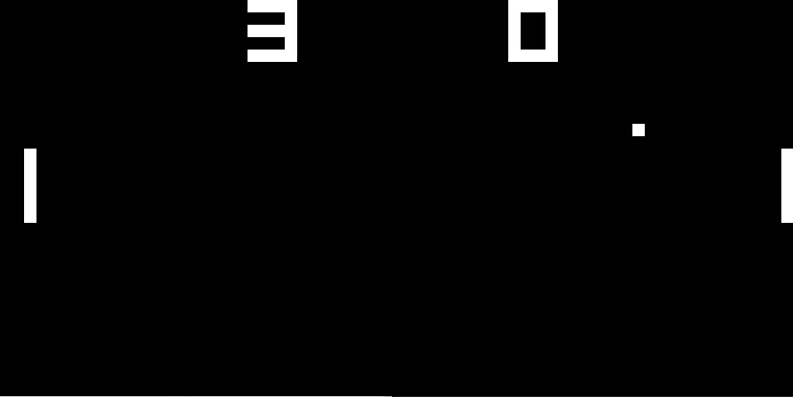
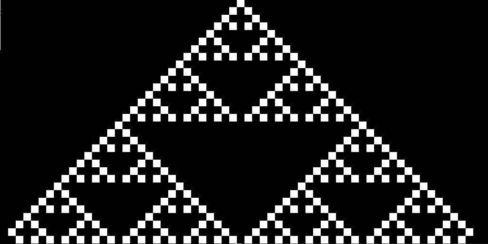
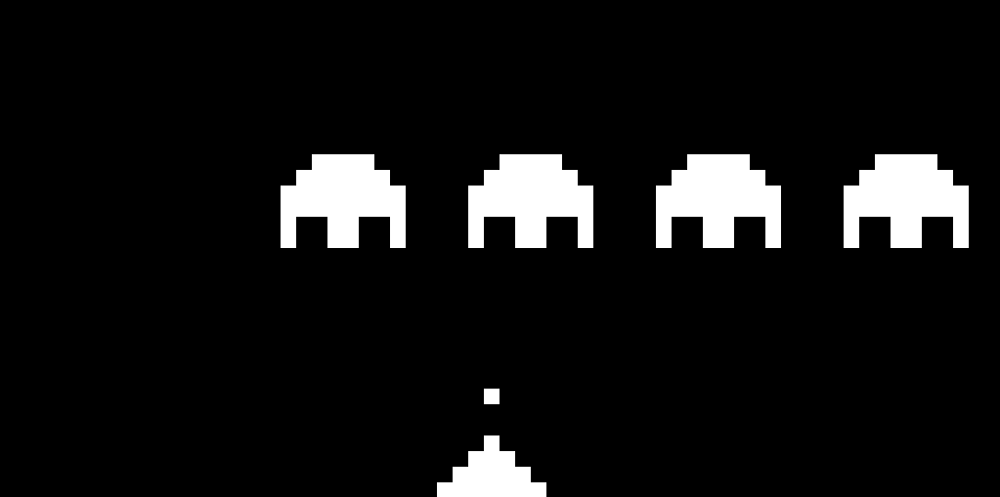

# CHIP-8 Emulator
This is a CHIP-8 emulator written in C. It has currently only been tested on Linux.

Opcodes and other information were taken from
[Cowgod's Chip-8 Technical Reference](http://devernay.free.fr/hacks/chip8/C8TECH10.HTM). 

While CHIP-8's display size is 64x32, pixels in this emulator are made 16 times
bigger, resulting in a window size of 1024x512. This can be changed by altering
`PIXEL_SIZE` in `io.h`.

For sound the system bell is used, which is rung by printing the ASCII BEL
character ('\\a').

The CHIP-8 hexademical input is mapped to:

|   |   |   |   |
| - | - | - | - |
| 1 | 2 | 3 | 4 |
| Q | W | E | R |
| A | S | D | F |
| Z | X | C | V |

Which translate to the following values:

|   |   |   |   |
| - | - | - | - |
| 1 | 2 | 3 | C |
| 4 | 5 | 6 | D |
| 7 | 8 | 9 | E |
| A | 0 | B | F |

## Screenshots

*Pong*


*Sierpiński triangle*


*Space Invaders*

## Building
Make sure you have SDL2 installed.
```bash
make
./chip8 <path to ROM>
```
